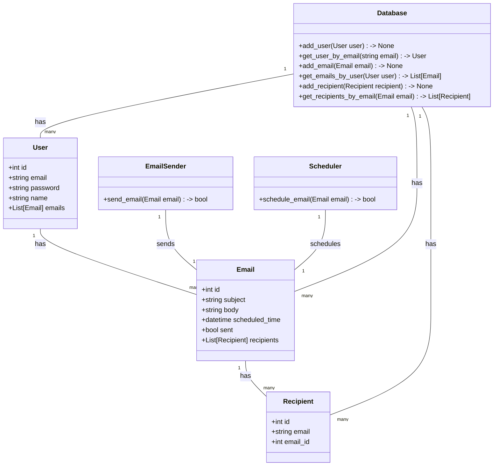
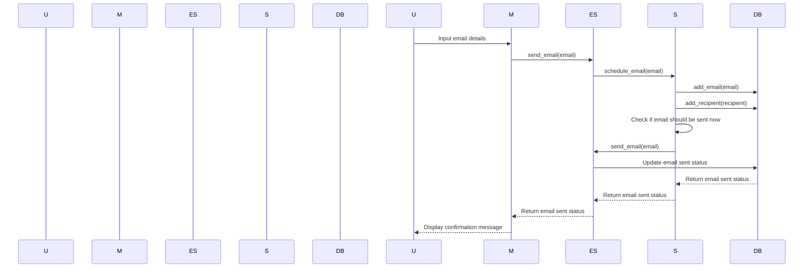

## Implementation approach:
For the implementation approach, we will use the following open-source tools:

1. Flask: A micro web framework for building web applications in Python.
2. APScheduler: A task scheduling library for Python that allows us to schedule emails at specific times.
3. Flask-Mail: An extension for Flask that provides email sending capabilities.
4. SQLAlchemy: A SQL toolkit and Object-Relational Mapping (ORM) library for Python.

We will use Flask to create a web application that allows users to input the necessary information to send emails. APScheduler will be used to schedule the emails at specific times. Flask-Mail will handle the email sending functionality. SQLAlchemy will be used for managing the database of email recipients.

## Python package name:
```python
"periodic_email_sender"
```

## File list:
```python
[
    "main.py",
    "models.py",
    "scheduler.py",
    "email_sender.py",
    "config.py"
]
```

## Data structures and interface definitions:


## Program call flow:


## Anything UNCLEAR:
The requirements are clear to me.